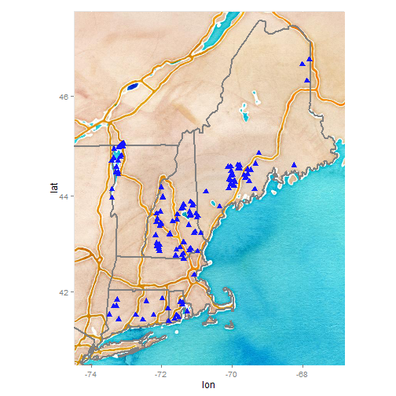

<!---
use these command instead of the knit icon if you want the data and work loaded into the R workspace
  library(knitr)
  setwd('Analysis')
  knit('NALMS2015.rmd')
  -->

To Do List
-------------------------
* everything


Introduction
-------------------------

This documents contains the analyses and figures for a poster at the 2015 NALMS meeting.

#Data Decisions#

* Only use data from the Beagle Fluorometers
* Restrict to readings recorded in ug/l
* Restrict to integrated tube samples
* For multiple samples for a visit to a lake (includes multiple sites, replicates, and multiple readings) record the min, max, and mean
* Use only the unfiltered samples
* Separate analysis for frozen and fresh samples

#Output#

* Map of 2014 sample locations
    - Map of lakes color coded by organization
* Participation stats
    - How many participants? Table Organization by sampleEvent; a sample event is a unique combination of sampleDate and sampleLocation
    - How many lakes? Summary/count information. Lakes by State
    - How many sample dates? Summary/count information. Organization by sample events
* How do phycocyanin measurements change over the course of the summer? How about chl-a? Perhaps a few example WBs in line graph format, or a map that shows the sizes of dots representing Phy and Chl-A concentrations, with a map for the averages of each month (not sure if Iâ<U+0080><U+0099>m describing this well, could do better over the phone).
    - Bryan: it will be interesting to see what this look likes.  We will need to address the issues raised at the beginning of the message.  We will also need to consider what to do with outliers.  There are some pretty unreasonable readings in the dataset.
    - DP: Hm, I would defer to you as the data expert on standard processes for dealing with outliers, but understood that they would really mess things up if weâ<U+0080><U+0099>re doing averages. My uninitiated intuition is to pick a value that we feel is a boundary of reasonable vs unreasonable and remove values above that. Could that be done?

Analysis
-------------------------

* Get the data and match it to the locations
* Restrict to Beagle data
* Create sampleDate from sampleYear, sampleMonth, & sampleDay
* Filter out calibration readings
* Filter out Turner fluorometer readings
    


* Data for counts 
    - includes 'Grab','Integrated', & 'VanDorn' samples
    - units read in RFU or ug/l
    - fresh and frozen samples
    - filtered and unfiltered samples
    
* Create a data.frame of unique sample events (Lake and Date)
* Create a data.frame of unique sampled lakes (Lake)
    


* Sample events aggregated by
    - Organization
    - State


```
## 
##    CRWA  CTDEEP   MEDEP   NHDES    RIWW UNH_CFB   VTDEC 
##      13      67      68      52      55      13      33
```

```
## 
## CT MA ME NH RI VT 
## 67 13 69 64 55 33
```

* Lakes sampled aggregated by
    - Organization
    - State


```
## 
##    CRWA  CTDEEP   MEDEP   NHDES    RIWW UNH_CFB   VTDEC 
##       1      11      33      39       9      10       1
```

```
## 
## CT MA ME NH RI VT 
## 11  1 34 48  9  1
```

* Lake Champlain was the only "lake" sampled in VT. But 19 sites were sampled within the lake.
    * We could say there were 19 "lakes" sampled in VT
    * This increases the number of sample events for State='VT' and Organization='VTDEC' from 33 to 46.
    * or we could just say there was one lake sampled on 33 dates.
* The Charles River was the only MA "lake".  It had four sites but I'm inclined to treat these a single waterbody.


* Get the lake location based on WBID
* Add the site locations for lake Champlain
* convert to SP objects


 

* Build dataset to evaluate fluorometry readings
* Filter data  
    - ug/l
    - integrated tube samples
    


* Not sure what to do about depth-here is a table of samples by depth
* For now I think I'll keep them all.


```r
table(Raw$Depth,useNA='ifany')
```

```
## 
##       0     0.5       1     1.1     1.2     1.5     1.6      10      11 
##     597      24    2770      16      28      16       8      39       6 
##      12      13      14      15       2       3       4    4.11    4.27 
##       6       6       6       6     153    2949      98       4       6 
##     4.5       5       6     6.5       7     7.5     7.8       8    8.27 
##      12      99     157      12      63      30      18      36       6 
##    8.37       9     9.6 surface 
##       6      34      14     122
```
  
* What about rep?
* Keep them all for now but work with means.


```r
table(Raw$Rep,useNA='ifany')
```

```
## 
##    1    2    3    4    5    6    7    8    9   10   11   12 <NA> 
## 2618 1132 1116   48   20   11    4    4    3    2    2    1 2386
```
    
* What about filtration?
* Let's just look at the unfiltered


```r
table(Raw$Filtered,useNA='ifany')
```

```
## 
## FALSE  TRUE 
##  4169  3178
```

```r
Keep<-Raw[Raw$Filtered==FALSE,]
  nrow(Keep) #4169
```

```
## [1] 4169
```
    
* What about freezing?
* Let's 


```r
table(Raw$Frozen,Raw$Parameter,useNA='ifany')
```

```
##        
##         Chlorophyll Phycocyanin
##   FALSE        2715        2743
##   TRUE          915         973
##   <NA>            0           1
```


* Look at the summary stats for:
    - Frozen Chla


summary()
Keep<-Raw[Raw$Filtered==FALSE,]
  nrow(Keep) #4169
```    
  
  
  
    


Data Definitions
-------------------------

Data.frame "Raw" has 7347 observations

Field  | Units | Description
------------- | ------------- | -------------
**ID:**|(integer)|Unique Identifier for each observation
**Organization:**|(text)|Name of the organization responsible for collecting the samples-e.g. Vermont DEC
**State:**|(lookup)|Two letter state code for site
**YourName:**|(text)|Name of the person entering the data
**SiteID:**|(text)|site ID from the Organization collecting the data (if they have one)
**WaterbodyName:**|(text)|Name of the sampled lake.
**SiteLocation:**|(text)|Some organizations have site names within a lake.
**SampleLocation:**|(lookup)|Where (in the lake) was the sample collected followed by the replicate number? WithinLake=WL1, WL2, or WL3; ShoreSide=SS1, SS2, SS3; Can also add Calibration or Blank for validation readings or Other.
**SampleYear:**|(YYYY)|Year sample was collected in format YYYY (e.g., 2014)
**SampleMonth:**|(MM)|Month sample was collected in integer format (e.g., months 1 to 12 )
**SampleDay:**|(DD)|Day sample was collected in integer format (e.g., day 1 to 31 )
**SampleHour:**|(HH)|Hour sample was taken in 24 hour format
**SampleMinutes:**|(MM)|Minute sample was taken in integer format
**NameOfSamplers:**|(text)|Names of the field crew separated by commas.
**WeatherConditions:**|(text)|General Weather conditions separated by commas.  E.g., Cloudy, Windy, Cold
**SampleMethod:**|(lookup)|How was the sample collected? Grab = Grab sample for surface blooms; Composite =Composite; Integrated = Integrated tube sample; Validation = Use this for Blanks and Calibration Standards; Other = give details in the comments section.
**Depth:**|(integer)|Within Lake samples are at 3m and Shoreside are at 1m.  If samples taken at different depths not the depth here and enter details in the comments section.  Leave blank for standards and blanks.
**Filtered:**|(TRUE/FALSE)|Was the sample filtered?
**Frozen:**|(TRUE/FALSE)|Was the sample frozen?
**Parameter:**|(lookup)|Phycocyanin or Chlorophyll?
**Value:**|(decimal)|Reading from the fluorometer
**Units:**|(lookup)|What were the units recorded.  If not "RFU" or "µ/L" flag the entry and add comment with the units used. 
**Rep:**|(integer)|If you made more than one measurement per sample or took more than one sample per site assign a replicate number to each observations and add notes in the comment field.
**Fluorometer:**|(lookup)|Type of fluorometer used?
**AnalysisYear:**|(YYYY)|Year sample was analyzed in format YYYY (e.g., 2014)
**AnalysisMonth:**|(MM)|Month sample was analyzed in integer format (e.g., months 1 to 12 )
**AnalysisDay:**|(DD)|Day sample was analyzed in integer format (e.g., day 1 to 31 )
**AnalysisHour:**|(HH)|Hour sample was analyzed in 24 hour format
**AnalysisMinutes:**|(MM)|Minute sample was analyzed in integer format
**GPSType:**|(text)|How was the location determined.  GPS (type), map, or google?
**Photos:**|(TRUE/FALSE)|Where photos taken?
**LocIDNew:**|(integer)|Unique Identifier for the Location.  See "Locations2014.rmd"
**Lon_LocIDNew**|(Decimal Degrees)|Longitude of the sample site identified by "LocIDNew"
**Lat_LocIDNew**|(Decimal Degrees)|Latitude of the sample site identified by "LocIDNew"
**WBID:**|(integer)|Unique Identifier for the Lake from the "WaterbodyDatabase.mdb".  See "Locations2014.rmd"
**Lon_WBID**|(Decimal Degrees)|Longitude of the centroid for the Lake identified by "WBID"
**Lat_WBID**|(Decimal Degrees)|Latitude of the centroid for the Lake identified by "WBID"
**Flag:**|(TRUE/FALSE)|Add a flag for any data line that needs further validation or processing
**Comments:**|(text)|Add details of flags or any notes about the data line or sample.


