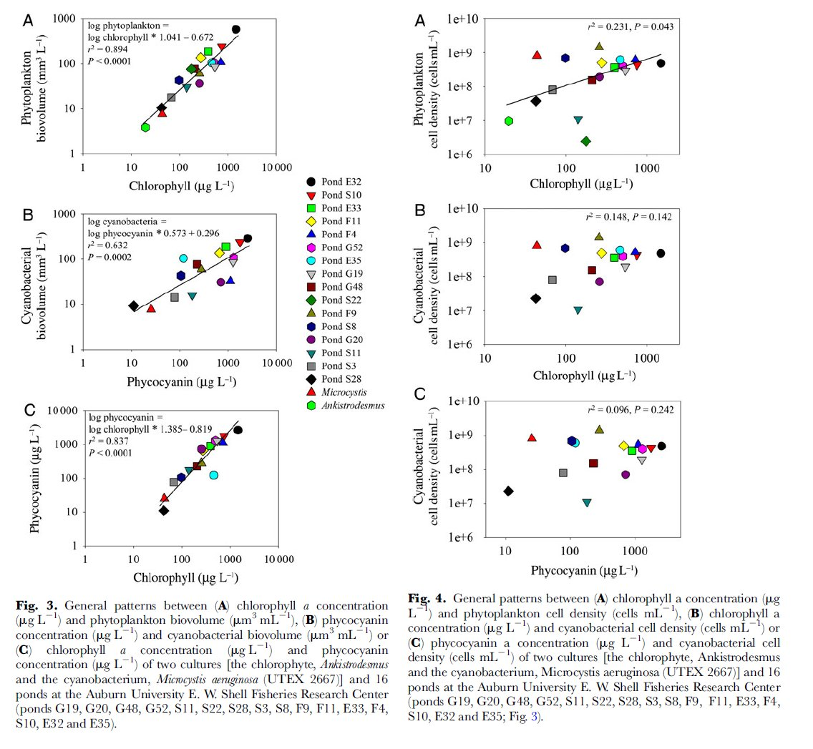

<!---
use these command instead of the knit icon if you want the data and work loaded into the R workspace
  library(knitr)
  setwd('Analysis')
  knit('comparePhycoChla2014.rmd')
  -->

To Do List
-------------------------
* everything

```{r setup, include=FALSE, echo=FALSE, cache=FALSE} 
  #########function to install (if needed) and load R packages by list
libs<-c("rgdal","sp","knitr","maptools","rgeos","ggplot2","ggmap","RODBC","dplyr") #list of packages to load

installLoad<-function(pck){ #user defined function
    if(!pck%in%installed.packages()){install.packages(pck)}
    require(pck, character.only = TRUE)
  }
lapply(libs,function(x) installLoad(x))  #Load/Install require packages
```

Introduction
-------------------------

The goal is to compare the values of chla and phycocyanin.
The expectation is that there should be a strong linear relationship (log log) between the two.

Data 
-------------------------

* get data from cyanoMon2014.mdb
* see CyanoMonDocumentation.Rmd

```{r Data, include=FALSE, echo=FALSE, cache=FALSE} 
con <- odbcConnectAccess("C:/Bryan/PortableApps/R/scripts/Reg1Cyano/Access/cyanoMon2014.mdb")
A <- sqlQuery(con, "
SELECT tblWaterbody.waterbodyID, tblStation.stationID, tblSample.sampleID, tblSample.sampleDate, tblSample.organization, tblSample.sampleMethod, tblSample.sampleDepthM, tblAnalysis.analysisID, tblAnalysis.analysisDate, tblAnalysis.frozen, tblAnalysis.filtered, tblFluorometry.parameter, tblFluorometry.reading, tblFluorometry.units, tblFluorometry.rep, tblFluorometry.fluorometerType
FROM tblWaterbody INNER JOIN (tblStation INNER JOIN (tblSample INNER JOIN (tblAnalysis INNER JOIN tblFluorometry ON tblAnalysis.analysisID = tblFluorometry.analysisID) ON tblSample.sampleID = tblAnalysis.sampleID) ON tblStation.stationID = tblSample.stationID) ON tblWaterbody.waterbodyID = tblStation.waterbodyID
")
close(con)
str(A)
```

##Build Dataset

* Get means for fluorometry readings to eliminate reps and duplicate; aggregate by c('analysisID','parameter','units','fluorometerType')

```{r means, include=FALSE, echo=FALSE, cache=FALSE} 
means<-aggregate(A$reading,list(A$analysisID,A$parameter,A$units,A$fluorometerType),mean,na.rm=TRUE)
names(means)<-c('analysisID','parameter','units','fluorometerType','reading')
means$reading[means$reading<.1]<-.1
```

* replace any values less than .1 with .1 to avoid zeros.
* merge Chla and Phycocyanin readings by c('analysisID','units','fluorometerType')
* merge back to main dataset


```{r fluor, include=FALSE, echo=FALSE, cache=FALSE} 
Chl<-subset(means[,-2],means$parameter=='Chlorophyll')
names(Chl)<-c('analysisID','units','fluorometerType','Chlorophyll')
nrow(Chl) #2420

Phy<-subset(means[,-2],means$parameter=='Phycocyanin')
names(Phy)<-c('analysisID','units','fluorometerType','Phycocyanin')
nrow(Phy) #2418

a<-inner_join(Chl,Phy,by=c('analysisID','units','fluorometerType'))

fluor<-inner_join(unique(A[,1:11]),a,by='analysisID')

#assign condition
cond<-rep(NA,nrow(fluor))
cond[fluor$frozen==TRUE & fluor$filtered==TRUE]<-'FrozenFiltered'
cond[fluor$frozen==FALSE & fluor$filtered==TRUE]<-'FreshFiltered'
cond[fluor$frozen==TRUE & fluor$filtered==FALSE]<-'FrozenUnfiltered'
cond[fluor$frozen==FALSE & fluor$filtered==FALSE]<-'FreshUnfiltered'
cond[is.na(fluor$frozen) | is.na(fluor$filtered)]<-NA
fluor$cond<-cond
```

##Analysis

```{r PlotCond, include=FALSE, echo=FALSE, cache=FALSE} 
PlotCond<-function(Fl){
  ggplot(fluor[fluor$fluorometerType==Fl,], aes(x=Chlorophyll, y=Phycocyanin)) + geom_point(shape=16)+ 
  scale_x_log10(breaks=c(1,10,100,1000),limits=c(.1,6100)) + 
  scale_y_log10(breaks=c(1,10,100,1000),limits=c(.1,55000)) + facet_grid(cond ~ units) +ggtitle(Fl)
}
```

* Based on Kasinak et al 2015 (Benchtop fluorometry of phycocyanin as a rapid approach for estimating cyanobacterial biovolume. Journal of Plankton Research 37(1): 248-257) We expect a strong log log relationship between Phycocyanin and Chlorophyll.  Below is figure from their paper that demonstrates this



* Let's plot Phycocyanin and Chlorophyll by sample condition and the Units that were reported
* First for the Beagle 

```{r Beagle, include=TRUE, echo=FALSE, cache=FALSE} 
PlotCond('Beagle')
```

* As you can see the relationship varies by how the sample was processed and the units used for measurement.

```{r Turner, include=TRUE, echo=FALSE, cache=FALSE} 
PlotCond('Turner')
```

* The Turner data only come from Sonya Carlson and it appears there is a mistake in the units.  Two of the plots use RFU and the other two 'ug/l'. Need to check with Sonya about this.

* That said, the data look similar to the Beagle data.

* What if we look at these relationships for the Beagle data by data source.

```{r PlotOrg, include=FALSE, echo=FALSE, cache=FALSE} 
PlotOrg<-function(Cond){
  ggplot(fluor[fluor$fluorometerType=='Beagle' & fluor$cond==Cond,], aes(x=Chlorophyll, y=Phycocyanin)) + geom_point(shape=16)+ scale_x_log10(breaks=c(1,10,100,1000),limits=c(.1,6100)) + 
  scale_y_log10(breaks=c(1,10,100,1000),limits=c(.1,55000)) + facet_grid(organization ~ units) +ggtitle(Cond)
}
```

```{r OrgPlots, include=TRUE, echo=FALSE, cache=FALSE} 
PlotOrg('FreshFiltered')
PlotOrg('FreshUnfiltered')
PlotOrg('FrozenFiltered')
PlotOrg('FrozenUnfiltered')
```

* Again, not sure how to interpret these.  But it looks like we get very different results depending on the sample processing and the organization.


